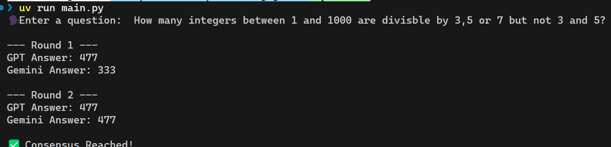

# 🗣️ DebatingAgents

An intelligent system that orchestrates a debate between two AI models to refine answers and reach consensus. Perfect for tackling math, logic, fact-checking, or coding challenges with enhanced reliability through collaborative reasoning. 


## 🖼️ Snapshot




## 🔧 Prerequisites

- Python 3.13 or higher
- uv (efficient Python package management)
- OpenAI API key
- Google Gemini API key

## 📥 Installation

- Clone the project

```
git clone https://github.com/smaranjitghose/DebatingAgents
```

- Navigate inside the directory

```
cd DebatingAgents
```

- Create a .env file and store the API keys from OpenAI and Google Gemini as:

```
OPENAI_API_KEY=your-openai-api-key-here
GEMINI_API_KEY=your-gemini-api-key-here
```

- Run the agent using uv (on the first run, it will create a virtual environment and install dependencies)

```
uv run main.py
```

- Start the debate with examples:

```
🗣️ You: How many prime numbers are less than 100?
```

## 💡 Usage Examples

- Math Problems
How many integers between 1 and 1000 are divisible by 3, 5, or 7 but not 3 and 5?

- Logic Puzzles
You found a treaure chest at the bottom of the Indian Ocean. There are 60 diamonds, twice as many rubies and one-third as many emeralds as rubies. What are the number of diamonds, rubies and emeralds you have?

- Programming Assistance
How many lines of code are needed for a basic binary search algorithm?

## 🔍 How It Works

- API Integration 🌐 - Connects to OpenAI and Gemini APIs using secure environment variables.
- Response Validation ✅ - Uses Pydantic to ensure structured responses (integer answer and explanation).
- Debate Protocol ⚔️ - Orchestrates up to 5 rounds of debate, comparing answers and prompting reconsideration.
- Consensus Checking 🤝 - Stops if agents agree or displays final answers if no consensus is reached.
- Console Output 📜 - Provides clear, real-time feedback on each round’s results.

Read more about the approach in the [blog post](https://blog.smaranjitghose.com/debating-agents) 📖.


## 🔧 Troubleshooting

- "Invalid API key" errors
    - Verify the .env file is in the project root directory.
    - Check that API keys are valid and have sufficient credits.
    - Ensure no extra spaces or quotes in the .env file.
- API connection errors
    - Confirm your internet connection is stable.
    - Check if OpenAI or Gemini APIs are experiencing downtime.
    - Try a different question to rule out specific prompt issues.
- Python import errors
```
uv add --upgrade openai google-generativeai pydantic python-dotenv
```

## 🤝 Contributing

Contributions are welcome! 🙏 Here's how:

1. Fork the repository

2.Create a feature branch

```
git switch -c feature/amazing-feature
```

3. Commit and push your changes

```
git commit -m "Add amazing feature"
git push origin feature/amazing-feature
```

5. Open a pull request

## 📝 License
This project is licensed under the MIT License - see the LICENSE file for details.

**Made with ❤️ by Smaranjit Ghose**
